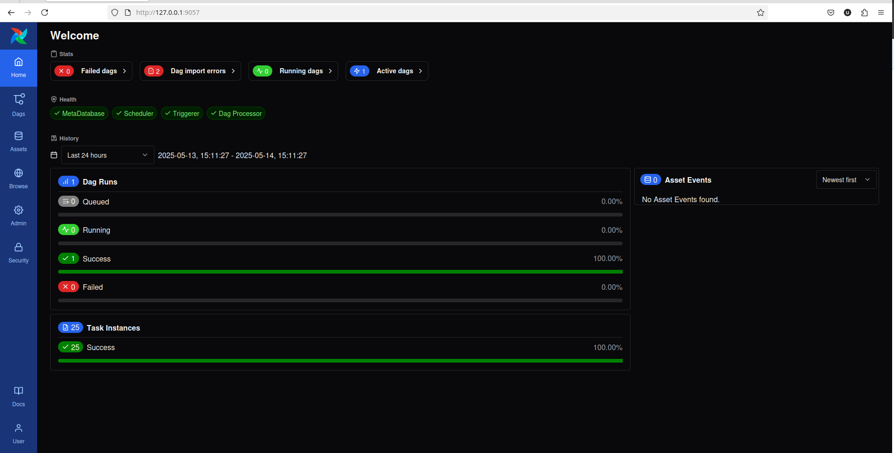
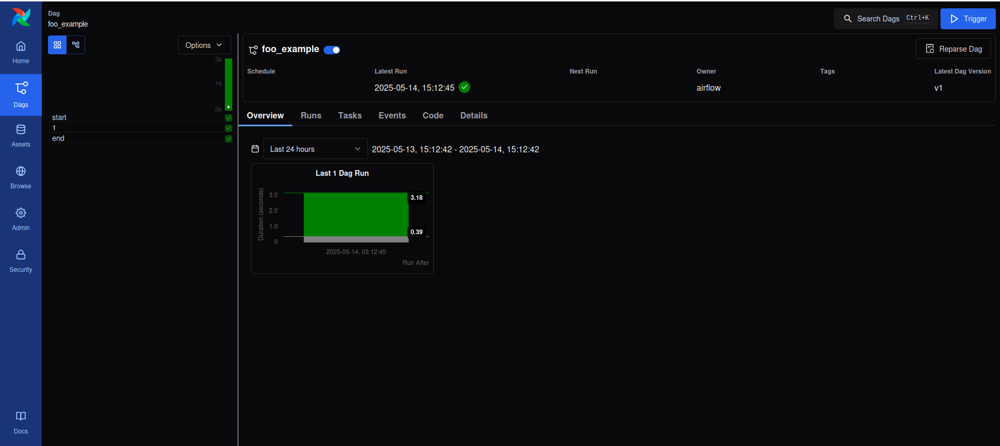

## To check Number of workers
celery -A airflow.executors.celery_executor status

### Movement from Airflow 2.9x to Airflow 3.0.1

Before - from airflow.operators.python_operator import PythonOperator, PythonVirtualenvOperator 

After - from airflow.operators.python import PythonOperator, PythonVirtualenvOperator 

Before - from airflow.operators.dummy_operator import DummyOperator

After - from airflow.operators.empty import EmptyOperator as DummyOperator

Before - from airflow.hooks.S3_hook import S3Hook

After - from airflow.providers.amazon.aws.hooks.s3 import S3Hook

Before - concurrency is removed 

After - max_active_tasks is new

Before - from airflow.models import Variable

After - from airflow.sdk import Variable

## Screen Shots 






### Configure ElasticSearch on Airflow 

curl -X GET "http://0.0.0.0:9200/airflow/_mapping?pretty"

curl -X GET "http://0.0.0.0:9200/_cat/indices?v"

curl -X GET "http://localhost:9200/_cluster/health"

curl -X GET "http://localhost:9200/airflow/_count"


[elasticsearch]

host = http://elasticsearch-cont:9200

log_id_template = {{ dag_id }}-{{ task_id }}-{{ execution_date }}-{{ try_number }}

end_of_log_mark = end_of_log

frontend = 

write_stdout = True

json_format = True

json_fields = asctime, filename, lineno, levelname, message

host_field = host

offset_field = offset

index_patterns = airflow*

[logging]

base_log_folder = /opt/airflow/logs

remote_logging = True

remote_base_log_folder = http://elasticsearch-cont:9200/airflow

#### In order to access hdfs from airflow 


```bash
hdfs dfs -mkdir -p /user/airflow
hdfs dfs -chown airflow:supergroup /user/airflow
```

#### Run backfill in Airflow Using cli 

```bash
airflow backfill create --dag-id spark_submit_example --from-date 2025-07-26T15:30:00 --to-date 2025-07-26T16:30:00
```

### DBT setup (using root)
change mode of dbt directory to ugo+rwx

```bash
sudo chmod -R ugo+rwx mnt/airflow-dbt-spark/
```
dbt debug --profiles-dir /home/airflow/.dbt/
dbt run --target=thrift-server --full-refresh
hdfs dfs -rm -r -skipTrash /user/hive/dbt_output/my_first_dbt_model || true